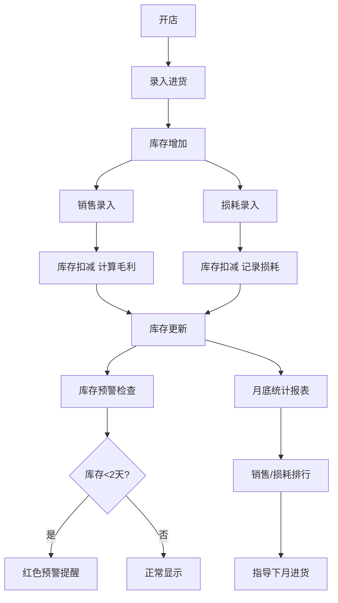

## 1. 产品概述

鲜果管家 - 专为小型水果店打造的进销存管理工具，帮助店主轻松管理进货、销售、损耗和库存，让经营决策更科学。

- 解决痛点：手工记账混乱、库存不清、损耗无法统计、供货商质量难以评估
- 目标用户：小型水果店店主/店员
- 产品价值：降低损耗、优化进货、提升毛利

## 2. 核心功能

### 2.1 用户角色

| 角色 | 注册方式 | 核心权限 |
|------|----------|----------|
| 店主 | 本地使用，无需注册 | 全部功能：进货、销售、损耗、库存、统计、供货商管理 |

### 2.2 功能模块

1. **仪表盘**：今日概览、库存预警、快捷操作入口
2. **进货管理**：记录每日进货（水果品种、重量、进价、供货商）
3. **销售管理**：快速录入销售，自动扣减库存、计算毛利
4. **损耗管理**：记录每日挑出的烂果，扣减库存
5. **库存管理**：实时库存查看、预计可售天数、低库存预警
6. **统计报表**：月度销售排行、损耗排行、毛利分析
7. **供货商管理**：供货商信息、质量评分、进货记录

### 2.3 页面详情

| 页面名称 | 模块名称 | 功能描述 |
|----------|----------|----------|
| 仪表盘 | 今日概览 | 显示今日进货金额、销售额、损耗金额、毛利 |
| 仪表盘 | 库存预警 | 显示库存不足2天的水果，红色醒目提醒 |
| 仪表盘 | 快捷操作 | 一键跳转进货、销售、损耗录入 |
| 进货管理 | 进货录入 | 选择水果品种、输入重量、进价、选择供货商 |
| 进货管理 | 进货历史 | 按日期查看历史进货记录 |
| 销售管理 | 销售录入 | 点选水果图标、输入销售重量、显示售价和毛利 |
| 销售管理 | 销售历史 | 查看销售流水 |
| 损耗管理 | 损耗录入 | 选择水果、输入损耗重量、选择原因（腐烂/磕碰/其他） |
| 损耗管理 | 损耗记录 | 查看历史损耗记录 |
| 库存管理 | 库存列表 | 显示每种水果当前库存、进价、预计可售天数 |
| 统计报表 | 销售排行 | 月度销量、销售额、毛利排行 |
| 统计报表 | 损耗排行 | 月度损耗重量、损耗金额、损耗率排行 |
| 供货商管理 | 供货商列表 | 供货商名称、联系方式、质量评分、历史供货记录 |

## 3. 核心流程

店主早上开店 → 录入进货数据 → 白天销售时快速录入 → 晚上关店前记录当日损耗 → 系统自动更新库存和毛利 → 月底查看统计报表指导下月进货决策。

## 4. 用户界面设计

### 4.1 设计风格
- **设计主题**：清新自然的水果风格，温暖活力
- **主色调**：暖橙色 (#FF8C42) - 代表新鲜、活力、水果
- **辅助色**：青草绿 (#6BCB77) - 代表新鲜、健康
- **警示色**：珊瑚红 (#FF6B6B) - 库存预警、损耗
- **信息色**：天蓝 (#4D96FF) - 数据、统计
- **背景色**：米白奶油色 (#FFF8F0) - 温暖舒适
- **卡片色**：纯白 (#FFFFFF)
- **按钮风格**：圆角大按钮 (12px)，柔和阴影，微交互动画
- **字体**：标题使用圆润字体「ZCOOL KuaiLe」，正文使用系统无衬线字体
- **布局风格**：卡片式布局，顶部导航栏 + 左侧标签导航，大量留白
- **图标风格**：水果 emoji 🍎🍌🍊🍇🍉 搭配线性图标

### 4.2 页面设计概览

| 页面名称 | 模块名称 | UI元素 |
|----------|----------|--------|
| 仪表盘 | 今日概览 | 4张数据卡片（进货/销售/损耗/毛利），数字放大显示，渐变色背景 |
| 仪表盘 | 库存预警 | 红色圆角卡片，库存不足水果列表，闪烁提醒效果 |
| 仪表盘 | 快捷操作 | 3个大图标按钮（进货📥/销售💰/损耗🗑️），悬停放大效果 |
| 进货管理 | 进货录入 | 水果选择区（emoji大按钮）、重量输入、进价输入、供货商下拉、提交按钮 |
| 销售管理 | 销售录入 | 水果emoji网格选择器、重量输入、自动计算售价和毛利、实时显示 |
| 库存管理 | 库存列表 | 表格视图，每行显示水果图片/名称/库存/可售天数/状态标签 |
| 统计报表 | 排行图表 | 水平条形图，不同颜色区分，鼠标悬停显示详情 |
| 供货商管理 | 供货商卡片 | 头像+名称+联系方式+星级评分+历史进货记录折叠面板 |

### 4.3 响应式
- 桌面端优先设计（1280px 以上）
- 平板端（768-1279px）：两栏布局自适应
- 移动端（<768px）：单栏布局，底部 Tab 导航，大按钮触控优化
- 所有表单元素支持触控操作

### 4.4 动效细节
- 页面加载：数据卡片依次淡入上滑（staggered 0.1s 延迟）
- 按钮交互：悬停时轻微上浮 + 阴影加深，点击时缩放反馈
- 库存预警：脉冲呼吸动画吸引注意
- 数据更新：数字滚动动画（从旧值滚动到新值）
- 模态框：从底部滑入 + 背景模糊遮罩
