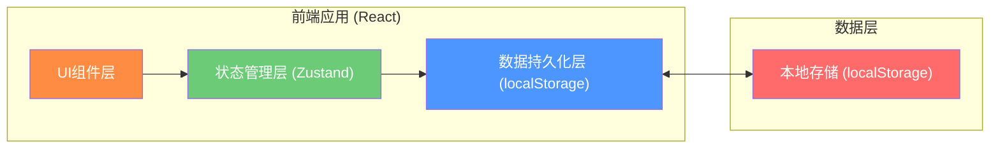
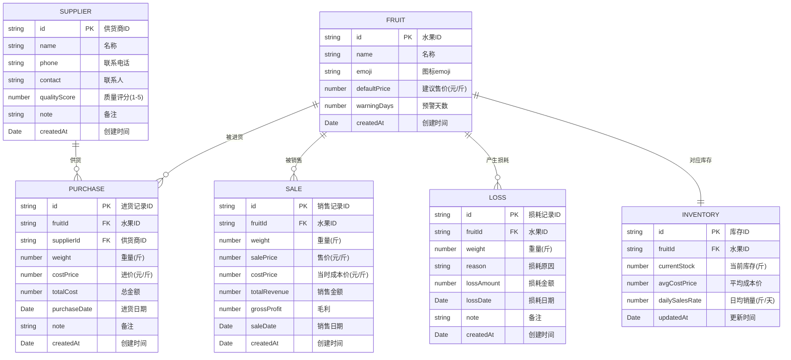

## 1. 架构设计



纯前端单页应用，无后端服务，所有数据通过 localStorage 持久化存储在浏览器本地。适合单店单机使用场景。

## 2. 技术说明

- **前端框架**：React@18 + TypeScript
- **构建工具**：Vite@5
- **样式方案**：TailwindCSS@3 + CSS 变量主题
- **状态管理**：Zustand (轻量级，适合小型应用)
- **数据持久化**：localStorage + zustand-persist 中间件
- **图表库**：Recharts (React 图表库，轻量美观)
- **图标方案**：Lucide React + 原生 Emoji
- **后端**：无（纯前端应用）
- **数据库**：localStorage（本地存储）
- **日期处理**：date-fns

## 3. 路由定义

| 路由 | 页面 | 用途 |
|------|------|------|
| / | Dashboard | 仪表盘 - 今日概览、库存预警、快捷操作 |
| /purchase | Purchase | 进货管理 - 进货录入、进货历史 |
| /sales | Sales | 销售管理 - 销售录入、销售流水 |
| /loss | Loss | 损耗管理 - 损耗录入、损耗记录 |
| /inventory | Inventory | 库存管理 - 实时库存、可售天数 |
| /reports | Reports | 统计报表 - 销售排行、损耗排行 |
| /suppliers | Suppliers | 供货商管理 - 供货商列表、质量评分 |

## 4. 数据模型

### 4.1 数据模型定义 (ER图)



### 4.2 初始数据 (预置)

**水果品种 (FRUIT)**：
- 🍎 苹果 - 建议售价 8.00元/斤
- 🍌 香蕉 - 建议售价 5.00元/斤  
- 🍊 橘子 - 建议售价 6.00元/斤
- 🍇 葡萄 - 建议售价 12.00元/斤
- 🍉 西瓜 - 建议售价 3.50元/斤

**供货商 (SUPPLIER)**：2-3个示例供货商

### 4.3 核心业务逻辑

1. **库存计算**：
   - 进货时：`currentStock += purchaseWeight`
   - 销售时：`currentStock -= saleWeight`
   - 损耗时：`currentStock -= lossWeight`

2. **平均成本价计算（加权平均法）**：
   - `newAvgCost = (oldStock * oldCost + purchaseWeight * purchaseCost) / (oldStock + purchaseWeight)`

3. **毛利计算**：
   - `grossProfit = saleWeight * (salePrice - avgCostPrice)`

4. **日均销量 & 预计可售天数**：
   - `dailySalesRate = 近7天总销量 / 7`
   - `estimatedDays = currentStock / dailySalesRate`（日均销量为0时显示"暂无数据"）

5. **库存预警**：
   - `estimatedDays < warningDays` 时触发预警

## 5. 项目结构

```
src/
├── components/          # 通用组件
│   ├── Layout/         # 布局组件（侧边栏、顶栏）
│   ├── FruitCard/      # 水果卡片
│   ├── StatCard/       # 统计数据卡片
│   └── Modal/          # 弹窗组件
├── pages/              # 页面组件
│   ├── Dashboard/      # 仪表盘
│   ├── Purchase/       # 进货管理
│   ├── Sales/          # 销售管理
│   ├── Loss/           # 损耗管理
│   ├── Inventory/      # 库存管理
│   ├── Reports/        # 统计报表
│   └── Suppliers/      # 供货商管理
├── store/              # Zustand 状态管理
│   ├── fruitStore.ts
│   ├── supplierStore.ts
│   ├── purchaseStore.ts
│   ├── saleStore.ts
│   ├── lossStore.ts
│   └── inventoryStore.ts
├── types/              # TypeScript 类型定义
│   └── index.ts
├── utils/              # 工具函数
│   ├── date.ts         # 日期处理
│   ├── calculation.ts  # 计算逻辑
│   └── storage.ts      # 存储工具
├── App.tsx
├── main.tsx
└── index.css           # 全局样式 + TailwindCSS 配置
```
